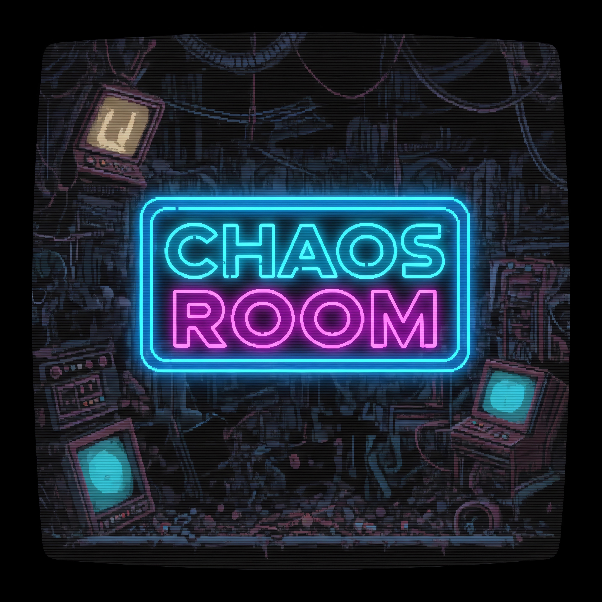

# ChaosRoom



**ChaosRoom** is a chaos engineering platform designed to stress test your infrastructure in controlled scenarios. Its goal is to help you understand how your systems behave under failure conditions, measure their resilience, and improve recovery strategies.  

ChaosRoom integrates with environments based on **Kubernetes**, **AWS**, and **Azure** to simulate pod crashes, VM terminations, or scaling challenges.  By combining a backend service, a configuration layer, and a playful frontend interface, ChaosRoom turns stress testing into a fun experience…and it also gives you a great excuse to occasionally be seen playing in front of your computer!  

After all, with ChaosRoom, you’re not just playing a game — you’re **actively testing and analyzing the resilience of your systems**.  Every in-game decision is a controlled experiment, helping you understand how your infrastructure responds under stress.  

So, when someone sees you “playing,” you can honestly say: *“I’m performing chaos engineering research!”* 😎


- [Architecture](#architecture)  
- [Server setup](#server-setup)  
- [Kubernetes quick test](#kubernetes-quick-test)  
- [Starting the Client](#starting-the-client)  
- [Creating the LÖVE Executable](#creating-the-löve-executable)
- [Credits](#credits)

## Architecture

TBD

## Server setup

You can test different environments: **Kubernetes**, **AWS**, or **Azure**. Choose and configure based on your setup. ChaosRoom backend will call your test server environment based on specific configuration

|  Environment| Configuration Required | 
|--|--|
| **Kubernetes** | In your Kubernetes cluster, under a specific namespace, there will be deployments that will be put under stress. The deployment selected for stress testing will have a certain number of replicas, which ChaosRoom will attempt to scale down to zero. The machine used to start the ChaosRoom server must have **kubectl** installed and properly configured.|
| **AWS** | Within an AWS subscription, you will need to configure an Auto Scaling Group with the EC2 instances of your service. These instances must have a specific tag that will be used to identify which machines are part of the test. ChaosRoom will trigger the termination of the tagged EC2 instances, monitoring the system’s scaling speed. The machine used to start the ChaosRoom server must have the **AWS CLI** installed and already configured for your subscription.|
| **Azure** | Within an Azure subscription, you will need to configure an Azure Virtual Machine Scale Set (VMSS) with the VMs of your service. These VMs must also have a specific tag that will be used to identify which machines are part of the test. ChaosRoom will trigger the termination of the tagged VMs, monitoring the system’s scaling speed. The machine used to start the ChaosRoom server must have the **Azure CLI** installed and authenticated against your subscription.|

Below is the configuration required to start the ChaosRoom server. This involves editing the **server/config.yaml** file and inserting the appropriate configurations based on the system you want to test.

```yaml
# config.yaml in backend
env: kubernetes  # or "aws", or "azure"

kubernetes:
  config_path: ~/.kube/config
  namespace: test-chaos-ns

aws:
  region: us-east-1
  tag_key: chaosroom
  tag_value: "true"
  states: ["running"]
  
azure:
  subscription_id: "xxx"
  resource_group: "RG"
  tag_key: "chaosroom"
  tag_value: "true"
  states: ["running"]
```

Next, you will need to start the server using the Python interpreter available on your system:

```bash
python server/main.py
```
 
  

## Kubernetes quick test

To simulate pods (or “victims”) when you have a local Kubernetes environment (e.g. minikube) or any cluster you can access, do the following:

1. Ensure `kubectl` is configured to talk to your test cluster (minikube or other).

2. Open the `test/` folder in the repo. There should be manifest files (e.g. `pod-test.yaml` or similar) that define Pod resources.

3. Modify them if needed (namespace, labels) so they are compatible with your cluster setup.

4. Apply them:

  

```bash

kubectl apply -f test/pod-test.yaml

```

  

5. Confirm pods are running:

  

```bash

kubectl get pods

```

There are three files available for deploying test simulations in your Kubernetes environment:

- **nginx-test.yaml**: Deploys 5 standard NGINX pods.  
- **nginx-slow-test.yaml**: Deploys 5 NGINX pods with a startup delay.  
- **postgres-test.yaml**: Deploys 5 PostgreSQL pods.  

Each configuration results in different pod availability times, allowing you to test various startup scenarios and timing conditions.  


  


## Starting the Client

  Once you have your remote test environment and the ChaosRoom backend (server) running, you can start the client (game) by providing the host and port of the server.  

To run the client, you need to have [LOVE2D](https://github.com/love2d/love) installed on your system. Then, launch the game with the following command:

```bash
love frontend/
```

When the game starts, you will first be prompted to enter the IP address of your backend. Use 127.0.0.1 if you are running the client on the same machine as the server.Next, you will be asked for the port number. By default, this is 8181, unless you have changed the server configuration.

After that, you simply choose how you want to make your test environment “suffer.” 🙂

To exit the game at any time, just press ESC.

  

## Creating the LÖVE Executable

You can package the client into a `.love` executable by navigating to the `frontend` folder and running:

```bash
zip -9 -r ../chaos-room.love *
```

This will generate a file named chaos-room.love in the parent directory.

The resulting file can be run using the [LÖVE](https://github.com/love2d/love) interpreter installed on your computer.
Alternatively, you can also use [RetroPie](https://retropie.org.uk/docs/Love/) to launch it on a gaming machine — just like in the screenshot below 🤓.


## Credits

- [Font VT323](https://fonts.google.com/specimen/VT323/) designed by [Peter Hull](https://fonts.google.com/?query=Peter%20Hull)
- Json library: [json.lua](https://github.com/rxi/json.lua), a lightweight JSON library for Lua
- Breakout game forked and modified by [https://github.com/IanSkelskey/Breakout](https://github.com/IanSkelskey/Breakout)
- Alien shooter graphics: [spaceship icons created by Wendy-G](https://www.flaticon.com/free-icons/spaceship)
- Alien shooter music: [Dark Star by Zambolino](https://www.free-stock-music.com/zambolino-dark-star.html)
- Zombie game forked and modified by [https://github.com/andsleonardo/love2d-top-down-shooter](https://github.com/andsleonardo/love2d-top-down-shooter)
- Zombie game music: [The Hunting by FSCM Productions](https://fscmproductions.bandcamp.com)
- Hours of coding vibes with [ChatGPT](https://chatgpt.com/)… with a few well-deserved smacks 

