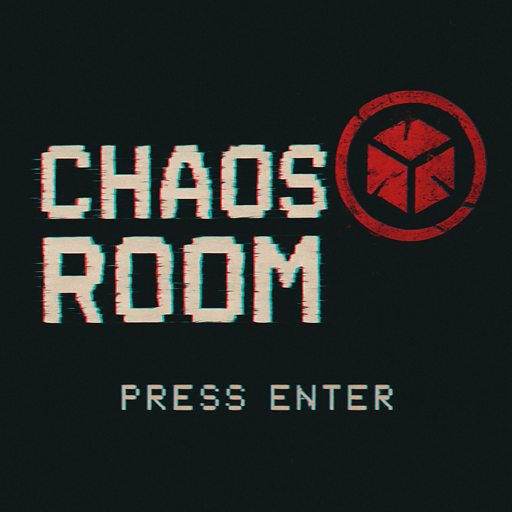

# Chaos Room
To be defined...

# Credits
- [Font VT323](https://fonts.google.com/specimen/VT323/) designed by [Peter Hull](https://fonts.google.com/?query=Peter%20Hull)
- Breakout game forked and modified by [https://github.com/IanSkelskey/Breakout](https://github.com/IanSkelskey/Breakout)
- Json library: [json.lua](https://github.com/rxi/json.lua), a lightweight JSON library for Lua 
- [Spaceship icons for alien shooter game created by Wendy-G](https://www.flaticon.com/free-icons/spaceship) 
- Alien shooter music: [Dark Star by Zambolino](https://www.free-stock-music.com/zambolino-dark-star.html)
